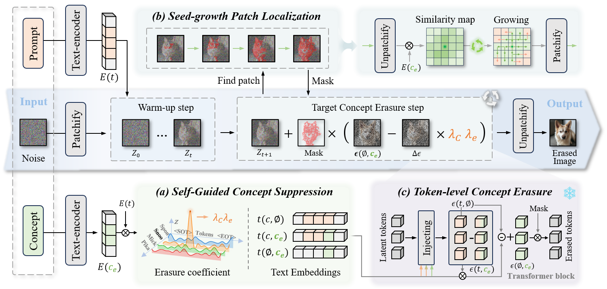

# SelfErase: Self-Guided Concept Tokens Erasure for Diffusion Transformers
<p align="center">
  
</p>

A **training-free** concept erasing method for **HunyuanDiT**. During sampling, it projects the text embedding onto a subspace and removes the direction of the target concept from the prompt representation, thereby suppressing the generation of the target concept (objects / styles / celebrities / NSFW, etc.) **without modifying model weights or any extra training**.

## Features

- **Zero training**: no fine-tuning, no LoRA. Erasing happens purely at inference time via representation projection.
- **Adaptive strength**: the erasing strength is estimated automatically from token similarities, no manual coefficient tuning.
- **Plug and play**: load the modified `HunyuanDiT2DModel` and enable erasing with a single `erase_concept` argument.
- **Multiple concept types**: objects (instance), styles (style), and celebrities (celebrity).

## Project Structure

```
SelfErase/
├── gen_images_multi.py      # Main entry: batch generation + concept erasing (recommended)
├── gen_images_nsfw.py       # Generation script dedicated to NSFW erasing
├── gen_images_0.py          # Legacy generation script
├── sd3_gen_images*.py       # SD3 baseline experiments (not Hunyuan)
├── template_config.py       # Prompt templates (instance / style / celebrity / test)
├── model/
│   ├── hunyuan_transformer_2d.py  # Modified HunyuanDiT Transformer (erasing logic injected)
│   ├── attention.py               # Attention module
│   └── tools.py                   # Utility functions
├── eval/                    # Evaluation scripts (CLIP / FID / classification / NudeNet)
├── outputs/                 # Generated results
└── requirements.txt         # Dependency list
```

## Requirements

- Linux + NVIDIA GPU (VRAM >= 12 GB, peak inference memory ~9.8 GB)
- CUDA 12.1
- Python 3.10

## 1. Installation

```bash
conda create -n hunyuan python=3.10 -y
conda activate hunyuan

# torch must match your local CUDA (this project is verified on CUDA 12.1)
pip install torch==2.7.1 torchvision==0.22.1 torchaudio==2.1.0 \
    --index-url https://download.pytorch.org/whl/cu121

pip install -r requirements.txt
```

## 2. Prepare the Model

On first run, HunyuanDiT-v1.2 (Diffusers distilled version) is downloaded automatically from HuggingFace. You can also download it beforehand:

```bash
huggingface-cli download Tencent-Hunyuan/HunyuanDiT-v1.2-Diffusers-Distilled \
    --local-dir ./HunyuanDiT-v1.2-Diffusers-Distilled
```

The default `--sd_ckpt` is `Tencent-Hunyuan/HunyuanDiT-v1.2-Diffusers-Distilled` (a HuggingFace repo id). To use a local path, point `--sd_ckpt` to the corresponding directory (it must contain a `transformer/` subdirectory).

## 3. Usage

The main entry is [gen_images_multi.py](gen_images_multi.py). It loads the modified `HunyuanDiT2DModel` into the pipeline and triggers subspace-projection erasing through the `erase_concept` argument in `__call__`.

### 3.1 Quick check (single prompt, no erasing)

First make sure the environment and model work:

```bash
python gen_images_multi.py \
    --prompt "a corgi running on the grass" \
    --GPU 0
```

The output is saved to `outputs/output.png`.

### 3.2 Concept erasing + batch generation

Generate a batch of contents by template while erasing a given concept:

```bash
python gen_images_multi.py \
    --erase_type instance \
    --erase_concept "dog" \
    --gen_contents "dog,cat,car" \
    --num_per_prompt 1 \
    --save_root ./outputs/multi \
    --GPU 0 \
    --save_oral True
```

Output directory layout:

```
outputs/multi/
├── erase_/          # Images after erasing (erase_concept removed)
│   ├── dog/
│   ├── cat/
│   └── car/
└── oral_erase_/     # Reference: original images without erasing (only when --save_oral True)
```

### Key Arguments

| Argument | Default | Description |
|----------|---------|-------------|
| `--sd_ckpt` | `Tencent-Hunyuan/HunyuanDiT-v1.2-Diffusers-Distilled` | Model repo id or local path |
| `--save_root` | `/outputs/multi` | Output root dir (recommend changing to `./outputs/multi`) |
| `--erase_type` | `test` | Prompt template type: `instance` (objects) / `style` (art style) / `celebrity` / `test` (single-template debug) |
| `--erase_concept` | `None` | Concept to erase; when `None`, no erasing, generation only |
| `--gen_contents` | `dog,cat` | Comma-separated list of contents; each is filled into the templates for batch generation |
| `--num_per_prompt` | `1` | Number of images per prompt |
| `--batch_size` | `1` | Sampling batch size, must be `<= num_per_prompt` |
| `--timesteps` | `25` | Number of sampling steps |
| `--seed` | `42` | Random seed |
| `--GPU` | `0` | GPU index to use |
| `--prompt` | `None` | Single-prompt direct mode (batch logic is ignored when set) |
| `--save_oral` | `False` | Whether to also save the non-erased reference images |

> `--erase_type` selects the prompt template set from [template_config.py](template_config.py). Each word in `gen_contents` is filled into the selected template set to generate the corresponding number of images.
>
> Note: the default `--save_root` is the absolute path `/outputs/multi`. You usually want to change it to a project-relative path (e.g. `./outputs/multi`), otherwise it writes to the filesystem root.

## 4. How It Works

The core logic lives in [model/hunyuan_transformer_2d.py](model/hunyuan_transformer_2d.py) and the `erase_projection_enhanced` / `erase_score_from_sims` functions in [gen_images_multi.py](gen_images_multi.py):

1. Encode `erase_concept` into an embedding representing the erasing direction.
2. Run SVD on the erasing embedding and take the subspace `Q` spanned by its principal directions (`mode="subspace"`).
3. Subtract the projection of the prompt embedding onto this subspace, so the representation no longer contains the target concept direction.
4. The erasing strength is estimated adaptively from token similarities (`erase_score_from_sims`). Two additional modes are provided: `iterative` (iterative soft projection) and `replace` (noise replacement).

The whole process happens at inference time and neither modifies nor saves any model weights.

## 5. Evaluation

The `eval/` directory provides several metric scripts (before running, open the file and change the image directory / paths at the top to your output directory):

- [eval/nudenet_batch_check.py](eval/nudenet_batch_check.py) — NudeNet batch NSFW detection, supports the command line:
  ```bash
  python eval/nudenet_batch_check.py --input_dir outputs/multi/erase_
  ```
- [eval/clip_score.py](eval/clip_score.py) — CLIP score (image-text consistency)
- [eval/evaluate_fid.py](eval/evaluate_fid.py) — FID (generation quality / distribution distance)
- [eval/classify.py](eval/classify.py) — classifier check for whether the concept is erased
- [eval/Sclip.py](eval/Sclip.py) — CLIP style similarity

## FAQ

- **Out of memory**: reduce `--num_per_prompt` / `--batch_size`, or lower `--timesteps`.
- **Model path error**: make sure the directory pointed to by `--sd_ckpt` contains a `transformer/` subdirectory; when using a repo id, make sure HuggingFace is reachable.
- **NaN under half precision**: the model is loaded in `torch.float16`. If a specific step produces NaN, switch that computation to `float32`.
- **Chinese/English prompts**: HunyuanDiT supports both Chinese and English prompts.
